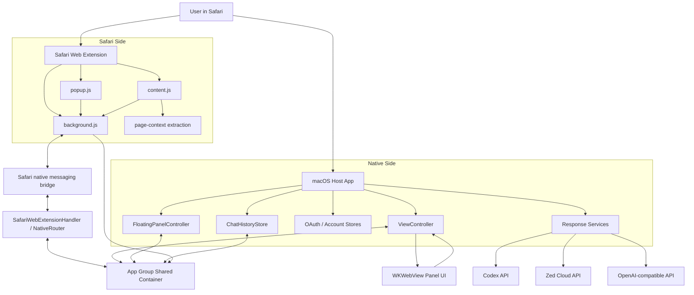
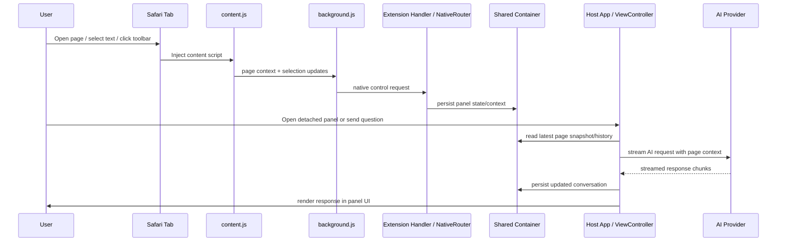
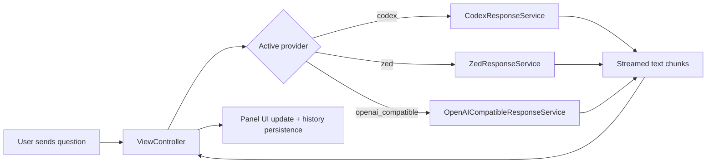

# Safarai

English | [中文版](./README.zh-CN.md)

Safarai is a macOS Safari AI assistant built as a native host app plus a Safari extension. It reads the current page context, keeps a synchronized chat panel, and lets the user ask questions, summarize pages, explain selections, extract structured information, and generate drafts for page inputs.

The codebase combines three layers:

- A macOS host app written in Swift/AppKit
- A Safari Web Extension written in JavaScript
- A shared persistence and message bridge between the two

## What It Does

Safarai is designed to make Safari pages queryable and actionable.

Main use cases implemented in the current codebase:

- Ask questions about the current page
- Explain highlighted text in page context
- Summarize articles and general pages
- Extract structured information from a page
- Generate drafts for the currently focused input field
- Infer and summarize video pages from page-visible signals such as title, description, chapters, comments, and metadata
- Keep chat history per thread, with pin/rename/delete/import/export support
- Switch between multiple AI providers
- Open a detached native chat window from the browser toolbar
- Sync page title, URL, selection, structure signals, visual signals, and interaction targets

## Supported Provider Modes

The app currently supports three provider paths:

- `Codex`
- `Zed`
- `OpenAI-compatible`

Each provider has its own account/configuration store and response service. The host app selects the active provider and streams the answer back into the panel UI.

## High-Level Architecture



## Runtime Data Flow



## Repository Structure

```text
safarai/
├── safarai/                         # Native macOS host app target
│   ├── AppDelegate.swift
│   ├── ViewController.swift
│   ├── FloatingPanelController.swift
│   ├── PanelStateStore.swift
│   ├── ProviderSettingsStore.swift
│   ├── CodexResponseService.swift
│   ├── ZedResponseService.swift
│   ├── OpenAICompatibleResponseService.swift
│   ├── UpdateService.swift
│   └── Resources/
│       ├── Base.lproj/Panel.html
│       ├── Panel.js
│       ├── Panel.css
│       └── Style.css
├── safarai Extension/               # Safari app/web extension target
│   ├── SafariWebExtensionHandler.swift
│   ├── NativeRouter.swift
│   ├── LocalProviderClient.swift
│   ├── ProviderConfig.swift
│   └── Resources/
│       ├── manifest.json
│       ├── background.js
│       ├── content.js
│       ├── popup.js
│       └── shared/
└── safarai.xcodeproj/               # Xcode project
```

## Core Components

### 1. Host App

The host app is the native control plane.

Key responsibilities:

- Owns the detached panel window and main chat window
- Hosts the panel UI in a `WKWebView`
- Receives UI commands from `Panel.js`
- Manages provider login/logout/model refresh
- Requests fresh page context from Safari
- Streams responses from AI providers
- Persists conversation state and chat history
- Handles app-level update checks via GitHub Releases
- Handles custom URL callbacks such as `safarai://start-codex-login` and `safarai://show-panel`

Important files:

- `safarai/AppDelegate.swift`
- `safarai/ViewController.swift`
- `safarai/FloatingPanelController.swift`
- `safarai/WindowPlacementCoordinator.swift`
- `safarai/SafariContextRefresher.swift`

### 2. Panel UI

The detached panel UI is plain HTML/CSS/JS loaded into a native `WKWebView`.

Capabilities visible in the current implementation:

- Conversation rendering
- Provider switching
- Model selection
- Thread history management
- Theme and language switching
- Page-follow / window-follow settings
- OpenAI-compatible endpoint and API key configuration
- Custom system prompt editing
- Update checking UI

Important files:

- `safarai/Resources/Base.lproj/Panel.html`
- `safarai/Resources/Panel.js`
- `safarai/Resources/Panel.css`
- `safarai/Resources/Style.css`

### 3. Safari Extension

The Safari extension captures browser-side context and exposes browser-native interactions.

Responsibilities:

- Injects `content.js` into pages
- Maintains background tab state in `background.js`
- Handles toolbar button and popup interactions
- Tracks active tab/page URL/title/selection
- Collects structured page context, article text, interaction targets, and video page metadata
- Syncs context into shared state for the native panel
- Bridges extension requests into native Swift code

Important files:

- `safarai Extension/Resources/manifest.json`
- `safarai Extension/Resources/background.js`
- `safarai Extension/Resources/content.js`
- `safarai Extension/Resources/popup.js`
- `safarai Extension/SafariWebExtensionHandler.swift`
- `safarai Extension/NativeRouter.swift`

### 4. Shared Container and Persistence

The host app and extension communicate mainly through the app group shared container: `group.ink.safarai`.

What is stored there:

- Latest panel snapshot
- Page context snapshot
- Selection intent
- Provider/account settings
- Active provider choice
- UI settings
- Chat history index and thread files

Important files:

- `safarai/SharedContainer.swift`
- `safarai Extension/SharedContainer.swift`
- `safarai/PanelStateStore.swift`
- `safarai Extension/PanelStateWriter.swift`

### 5. Provider Integration Layer

The host app contains the main multi-provider inference path.

Provider-specific services:

- `CodexResponseService.swift`: streams from the Codex backend
- `ZedResponseService.swift`: streams from Zed Cloud and refreshes LLM tokens
- `OpenAICompatibleResponseService.swift`: calls `/chat/completions` and `/models` on OpenAI-compatible endpoints

The extension also contains a lighter native-side provider client:

- `LocalProviderClient.swift`

That client is mainly used for extension-native actions routed via `NativeRouter`, especially popup/browser-triggered flows.

## Feature Breakdown

### Page Context Extraction

Current context model includes:

- Site identifier
- URL
- Title
- Selected text
- Extracted article text
- Structure summary
- Interactive target summary
- Visual summary
- Video page metadata
- Metadata describing page kind, transport mode, sync source, and debug signals

The extension updates context aggressively on:

- Page load
- SPA navigation
- Visibility/focus changes
- Selection changes
- Active tab switches

### Chat History

The app maintains thread-based chat history with JSON persistence.

Implemented operations include:

- Create thread automatically on first message
- Rename thread
- Pin/unpin thread
- Delete thread
- Change history storage location
- Reset to default location
- Import history library
- Export history library

### Video-Aware Assistance

For video pages, the app can infer a summary from page-visible signals:

- Video title, author, description, chapters, and important-moment text when present
- Comment timestamp signals as collective attention hints
- Page metadata indicating video state

The app does not fetch platform captions, record audio, transcribe media, or sample video frames. Video answers should state when they are based on page content rather than direct video understanding.

### Multi-Language and Theme Support

The panel currently includes built-in UI strings for:

- English
- Chinese

Theme options visible in the UI include:

- Blue
- Orange
- Gray
- Purple
- Green

## Native/Extension Message Types

The bridge currently routes two broad classes of native requests.

Control requests:

- `get_status`
- `start_login`
- `logout`
- `refresh_models`
- `save_selected_model`
- `show_panel`
- `sync_panel_state`
- `sync_selection_intent`

Provider requests:

- `summarize_page`
- `explain_selection`
- `extract_structured_info`
- `draft_for_input`
- `ask_page`

## Provider Selection Flow



## Storage Model

The exact filenames are implementation details, but the code clearly uses shared JSON files for state/config and a folder-based thread history store.

Examples visible in code:

- `provider.json`
- `active-provider.json`
- `openai-compatible-provider.json`
- `codex-account.json`
- `ui-settings.json`
- thread index and per-thread JSON records under the history folder

## Build and Run

## Requirements

- macOS 14.0+
- Xcode with Safari extension support
- A Safari environment where the extension can be enabled

## Open in Xcode

1. Open `safarai.xcodeproj`.
2. Select the `safarai` app target.
3. Build and run the macOS app.
4. Enable the Safari extension in Safari Settings > Extensions.
5. Grant website access if Safari prompts for it.

## First-Run Flow

1. Launch the app.
2. Enable the bundled Safari extension.
3. Open any page in Safari.
4. Click the toolbar button or open the detached panel.
5. Sign in to a provider or configure an OpenAI-compatible endpoint.

## Development Notes

- This project does not use a JS bundler; extension and panel scripts are plain JavaScript files checked into the repo.
- The native UI layer is AppKit-based, not SwiftUI.
- The host app and extension share state through an App Group container rather than a local HTTP server.
- Update checks are implemented against GitHub Releases, not Sparkle.

## Testing

The JavaScript logic shared by the extension (page-context extraction, write-target resolution, message protocol, and session/log pruning) is covered by Node's built-in test runner. From the repository root:

```bash
npm test
```

This runs `node --test` against the suites under `tests/`. No dependencies or bundler are required.

## Security and Privacy Notes

Based on the current implementation:

- Sensitive settings are written into private files inside the shared container
- OpenAI-compatible credentials are stored locally
- Browser page context can include selected text, article text, page-visible video signals, and video-related metadata
- Zed integration reads a local Zed SQLite database to obtain `system_id`

Anyone extending this project should review data retention and credential handling carefully before production distribution.

## Notable Implementation Characteristics

- Streaming responses are supported for all main provider paths
- The panel can follow Safari window placement
- The extension keeps retrying/synchronizing page context for dynamic pages
- The project supports both popup-style interaction and detached native-panel interaction
- The codebase is strongly optimized around Safari-specific workflows rather than being a cross-browser extension shell

## Recommended Reading Order

If you are new to the codebase, start here:

1. `safarai/ViewController.swift`
2. `safarai/PanelStateStore.swift`
3. `safarai Extension/Resources/background.js`
4. `safarai Extension/Resources/content.js`
5. `safarai Extension/NativeRouter.swift`
6. `safarai/CodexResponseService.swift`
7. `safarai/ZedResponseService.swift`
8. `safarai/OpenAICompatibleResponseService.swift`

## Current Positioning in One Sentence

Safarai is a Safari-centric AI assistant for macOS that turns the active page, selection, and page interactions into structured context for multi-provider conversational assistance.
