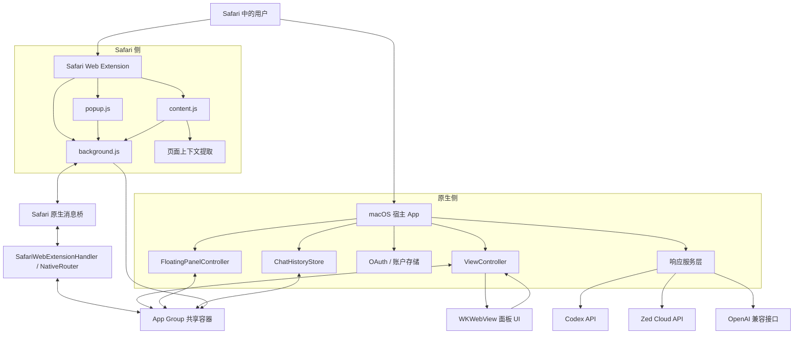
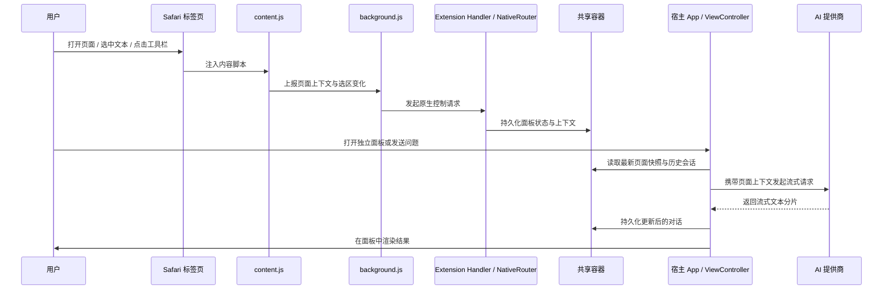
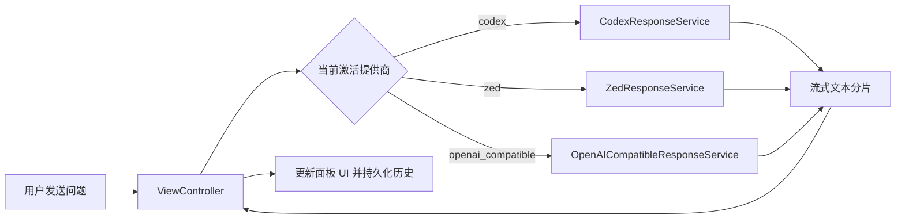

# Safarai

[English](./README.md) | 中文版

Safarai 是一个面向 macOS Safari 的 AI 助手项目，采用“原生宿主 App + Safari 扩展”双端架构。它会读取当前网页上下文、同步聊天面板状态，并支持围绕当前页面进行提问、摘要、选中文本解释、结构化提取，以及为页面输入框生成草稿。

这个仓库当前主要由三层组成：

- 使用 Swift/AppKit 编写的 macOS 宿主应用
- 使用 JavaScript 编写的 Safari Web Extension
- 宿主与扩展之间的共享存储和消息桥接层

## 项目用途

Safarai 的目标不是做一个通用聊天窗口，而是把“当前 Safari 页面”变成可提问、可操作、可延展的 AI 上下文。

从现有代码实现来看，项目支持的主要用途包括：

- 对当前页面进行问答
- 结合页面上下文解释用户选中的文本
- 总结文章页或通用网页内容
- 从页面中提取结构化信息
- 为当前聚焦的输入框生成草稿
- 基于标题、简介、章节、评论和 metadata 等页面可见线索推测并总结视频页面
- 维护带线程的聊天历史，支持置顶、重命名、删除、导入、导出
- 在多个 AI 提供商之间切换
- 从浏览器工具栏打开独立原生聊天面板
- 同步页面标题、URL、选区、结构信号、视觉信号、可交互目标等上下文信息

## 当前支持的 AI 提供商

代码中已实现三条提供商路径：

- `Codex`
- `Zed`
- `OpenAI-compatible`

每一种提供商都有对应的账户/配置存储与响应服务，宿主 App 会根据当前激活的提供商发起请求，并将流式结果回写到面板 UI。

## 总体架构



## 运行时数据流



## 仓库结构

```text
safarai/
├── safarai/                         # 原生 macOS 宿主应用 target
│   ├── AppDelegate.swift
│   ├── ViewController.swift
│   ├── FloatingPanelController.swift
│   ├── PanelStateStore.swift
│   ├── ProviderSettingsStore.swift
│   ├── CodexResponseService.swift
│   ├── ZedResponseService.swift
│   ├── OpenAICompatibleResponseService.swift
│   ├── UpdateService.swift
│   └── Resources/
│       ├── Base.lproj/Panel.html
│       ├── Panel.js
│       ├── Panel.css
│       └── Style.css
├── safarai Extension/               # Safari App/Web Extension target
│   ├── SafariWebExtensionHandler.swift
│   ├── NativeRouter.swift
│   ├── LocalProviderClient.swift
│   ├── ProviderConfig.swift
│   └── Resources/
│       ├── manifest.json
│       ├── background.js
│       ├── content.js
│       ├── popup.js
│       └── shared/
└── safarai.xcodeproj/               # Xcode 工程
```

## 核心模块说明

### 1. 宿主 App

宿主 App 是整个系统的原生控制中心。

主要职责：

- 管理独立面板窗口和主聊天窗口
- 通过 `WKWebView` 承载面板 UI
- 接收来自 `Panel.js` 的前端命令
- 负责提供商登录、登出、模型刷新
- 主动向 Safari 请求最新页面上下文
- 调用 AI 提供商并处理流式输出
- 持久化会话状态与聊天历史
- 基于 GitHub Releases 检查更新
- 处理 `safarai://start-codex-login`、`safarai://show-panel` 等自定义 URL 回调

关键文件：

- `safarai/AppDelegate.swift`
- `safarai/ViewController.swift`
- `safarai/FloatingPanelController.swift`
- `safarai/WindowPlacementCoordinator.swift`
- `safarai/SafariContextRefresher.swift`

### 2. 面板 UI

独立面板 UI 由原生 `WKWebView` 加载本地 HTML/CSS/JS 组成，没有引入前端框架。

从现有实现看，面板具备：

- 对话渲染
- 提供商切换
- 模型选择
- 历史线程管理
- 主题与语言切换
- 页面颜色跟随 / Safari 窗口跟随设置
- OpenAI 兼容端点和 API Key 配置
- 自定义 system prompt 编辑
- 更新检查入口

关键文件：

- `safarai/Resources/Base.lproj/Panel.html`
- `safarai/Resources/Panel.js`
- `safarai/Resources/Panel.css`
- `safarai/Resources/Style.css`

### 3. Safari 扩展

Safari 扩展负责浏览器侧上下文采集与浏览器能力接入。

主要职责：

- 通过 `content.js` 注入网页
- 通过 `background.js` 维护标签页上下文状态
- 处理工具栏按钮和 popup 面板交互
- 跟踪当前活动标签页的 URL、标题和选中文本
- 提取页面正文、结构摘要、交互目标、视频页面 metadata 等上下文信息
- 将页面上下文同步到共享状态，供原生面板读取
- 把扩展请求桥接到 Swift 原生逻辑

关键文件：

- `safarai Extension/Resources/manifest.json`
- `safarai Extension/Resources/background.js`
- `safarai Extension/Resources/content.js`
- `safarai Extension/Resources/popup.js`
- `safarai Extension/SafariWebExtensionHandler.swift`
- `safarai Extension/NativeRouter.swift`

### 4. 共享容器与持久化

宿主 App 与扩展主要通过 App Group 共享容器通信，标识符是 `group.ink.safarai`。

这里面存放的内容包括：

- 最新面板快照
- 页面上下文快照
- 选区意图
- 提供商与账户配置
- 当前激活的提供商
- UI 设置
- 聊天历史索引与线程文件

关键文件：

- `safarai/SharedContainer.swift`
- `safarai Extension/SharedContainer.swift`
- `safarai/PanelStateStore.swift`
- `safarai Extension/PanelStateWriter.swift`

### 5. 提供商集成层

宿主 App 中实现了主要的多提供商推理链路。

各提供商响应服务：

- `CodexResponseService.swift`：对接 Codex 后端并处理流式输出
- `ZedResponseService.swift`：对接 Zed Cloud，并负责 LLM token 刷新
- `OpenAICompatibleResponseService.swift`：对接 OpenAI 兼容接口的 `/chat/completions` 与 `/models`

扩展侧还包含一个较轻量的原生 provider client：

- `LocalProviderClient.swift`

它主要服务于经由 `NativeRouter` 路由的扩展原生动作，比如 popup 或浏览器动作触发的请求流程。

## 功能拆解

### 页面上下文提取

当前上下文模型包含：

- 站点标识
- URL
- 页面标题
- 当前选中文本
- 抽取出的正文文本
- 结构摘要
- 可交互目标摘要
- 视觉摘要
- 视频页面 metadata
- 描述页面类型、同步来源、传输方式、调试信号的 metadata

扩展会在以下时机频繁刷新上下文：

- 页面加载
- 单页应用路由变化
- 窗口可见性和焦点变化
- 文本选区变化
- 活动标签页切换

### 聊天历史

项目实现了基于线程的聊天历史管理，底层是 JSON 持久化。

当前已支持：

- 首次发消息时自动建线程
- 重命名线程
- 置顶/取消置顶
- 删除线程
- 修改历史存储目录
- 恢复默认目录
- 导入历史库
- 导出历史库

### 视频增强能力

针对视频页面，项目会基于页面可见线索增强提示词：

- 视频标题、作者、简介、章节和重要时刻文本
- 评论中的时间戳信号，作为集体注意力提示
- 页面 metadata 中的视频状态信息

应用不会抓取平台字幕、录音转写、读取音频，也不会采样视频画面。视频相关回答应明确说明它是基于页面内容线索推测，而不是直接读取视频内部内容。

### 多语言与主题

当前面板内置了两套 UI 文案：

- English
- 中文

在 UI 中可见的主题包括：

- Blue
- Orange
- Gray
- Purple
- Green

## 原生桥接消息类型

代码中当前桥接了两大类原生请求。

控制类请求：

- `get_status`
- `start_login`
- `logout`
- `refresh_models`
- `save_selected_model`
- `show_panel`
- `sync_panel_state`
- `sync_selection_intent`

推理类请求：

- `summarize_page`
- `explain_selection`
- `extract_structured_info`
- `draft_for_input`
- `ask_page`

## 提供商选择流程



## 存储模型

虽然具体文件名属于实现细节，但从代码可以直接看出，项目使用共享容器中的 JSON 文件保存状态与配置，并以目录形式保存线程历史。

代码中出现的典型文件包括：

- `provider.json`
- `active-provider.json`
- `openai-compatible-provider.json`
- `codex-account.json`
- `ui-settings.json`
- 历史目录下的线程索引和每线程 JSON 文件

## 构建与运行

## 环境要求

- macOS 14.0 及以上
- 支持 Safari Extension 的 Xcode
- 可启用扩展的 Safari 环境

## 在 Xcode 中运行

1. 打开 `safarai.xcodeproj`。
2. 选择 `safarai` App target。
3. 编译并运行 macOS 应用。
4. 在 Safari 设置 > 扩展 中启用该扩展。
5. 如果 Safari 弹出权限请求，允许网站访问权限。

## 首次使用流程

1. 启动 App。
2. 启用内置的 Safari 扩展。
3. 在 Safari 中打开任意页面。
4. 点击工具栏按钮或打开独立面板。
5. 登录某个 provider，或配置一个 OpenAI 兼容接口。

## 开发说明

- 这个项目没有使用 JS 打包器，扩展脚本和面板脚本都是直接入仓的原始 JavaScript 文件。
- 原生 UI 层采用 AppKit，而不是 SwiftUI。
- 宿主 App 与扩展通过 App Group 共享容器共享状态，而不是通过本地 HTTP 服务通信。
- 更新检查基于 GitHub Releases 实现，并没有接入 Sparkle。

## 测试

扩展所共享的 JavaScript 逻辑（页面上下文抽取、写入目标定位、消息协议、会话/日志裁剪）由 Node 内置测试运行器覆盖。在仓库根目录执行：

```bash
npm test
```

该命令会用 `node --test` 运行 `tests/` 下的测试套件，无需任何依赖或打包器。

## 安全与隐私说明

根据当前代码实现，可以明确看到：

- 敏感设置会写入共享容器中的私有文件
- OpenAI 兼容接口的凭据存储在本地
- 浏览器页面上下文可能包含选中文本、正文文本、视频页面可见线索和视频相关 metadata
- Zed 集成会读取本机 Zed 的 SQLite 数据库，以获取 `system_id`

如果要把这个项目继续产品化或对外分发，建议重点审视数据保留策略与凭据管理方式。

## 这个项目的几个鲜明特点

- 三条主要 provider 路径都支持流式输出
- 面板支持跟随 Safari 窗口位置
- 扩展会对动态页面持续重试并同步上下文
- 同时支持 popup 风格交互和独立原生面板交互
- 整个架构高度围绕 Safari 场景优化，而不是通用跨浏览器外壳

## 建议阅读顺序

如果你第一次接手这个仓库，建议按下面顺序阅读：

1. `safarai/ViewController.swift`
2. `safarai/PanelStateStore.swift`
3. `safarai Extension/Resources/background.js`
4. `safarai Extension/Resources/content.js`
5. `safarai Extension/NativeRouter.swift`
6. `safarai/CodexResponseService.swift`
7. `safarai/ZedResponseService.swift`
8. `safarai/OpenAICompatibleResponseService.swift`

## 一句话定位

Safarai 是一个面向 macOS Safari 的页面内 AI 助手，它把当前网页、选区和交互目标转换成结构化上下文，再分发给多个 AI 提供商完成对话式辅助。
